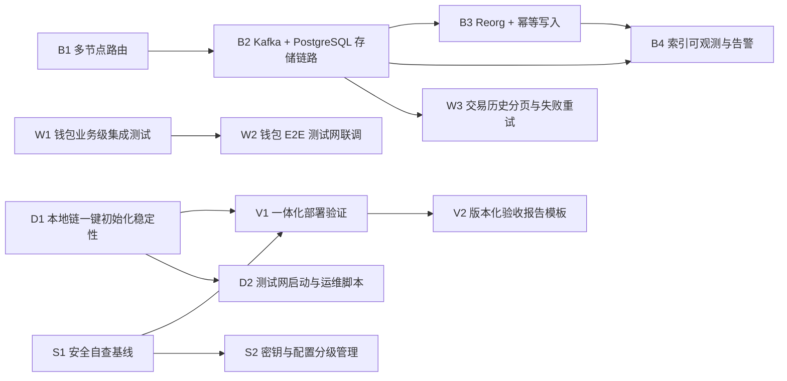

# 下一阶段开发目标 Spec

## Why
当前项目已具备钱包核心模块与基础部署测试能力，但缺少统一的“下一阶段可执行目标清单”。需要将目标标准化，便于团队按优先级推进与验收。

## What Changes
- 新增“下一阶段开发目标”清单，覆盖钱包、后端、部署、安全与验证五个方向
- 为每个目标定义目标产出、验收标准、依赖关系和完成定义
- 明确优先级分层（P0/P1/P2）与建议执行顺序

## Impact
- Affected specs: 钱包身份层、交易层、后端索引层、部署测试流水线、安全审计基线
- Affected code: `soulon-wallet`、`soulon-backend`、`deploy` 脚本与文档体系

## Goal Pool（按优先级分层，含可量化验收）
### P0（当前迭代必须完成）
- **Goal W1（Wallet）**：增加 staking 与 governance 场景的业务级集成测试  
  **Deliverables**：可运行的集成测试脚本、测试数据模板、执行说明  
  **Acceptance**：覆盖委托/撤销委托/奖励领取/提案查询/投票 5 条主链路；连续执行 3 次通过率 100%；单次全量执行时长 ≤ 15 分钟  
  **Dependencies**：本地链或测试网可用，部署测试配置可复用
- **Goal B1（Backend）**：接入 gRPC 与 JSON-RPC 多节点路由  
  **Deliverables**：节点路由策略实现、健康检查模块、网关接入配置  
  **Acceptance**：至少接入 3 个节点；1 个节点故障时 60 秒内自动切换；对外接口可用性在压测窗口内 ≥ 99%  
  **Dependencies**：节点清单与健康检查规则
- **Goal B2（Backend）**：接入 Kafka 与 PostgreSQL 存储链路  
  **Deliverables**：事件入队、消费、持久化链路与消费位点记录  
  **Acceptance**：关键事件端到端落库成功率 ≥ 99.5%；消费位点可查询并可恢复；同批次对账误差 = 0  
  **Dependencies**：B1 稳定数据输入，Kafka/PostgreSQL 环境可用
- **Goal D1（Deploy）**：完善本地链一键初始化与启动稳定性  
  **Deliverables**：本地链初始化脚本、参数模板、失败重试流程  
  **Acceptance**：DryRun 与在线模式均可完成启动；在干净环境连续执行 5 次成功率 100%；单次启动耗时 ≤ 10 分钟  
  **Dependencies**：链二进制与环境变量模板可用
- **Goal S1（Security）**：固化部署测试安全自查基线并纳入常规流程  
  **Deliverables**：安全扫描规则、统一执行入口、失败阻断策略  
  **Acceptance**：默认流水线必跑安全自查；命中高危规则时 100% 阻断；每次执行输出可追踪报告  
  **Dependencies**：部署测试脚本稳定运行
- **Goal V1（Validation）**：统一链端与钱包的一体化部署验证流程  
  **Deliverables**：一体化执行脚本、通过标准对照清单、结果汇总输出  
  **Acceptance**：一键完成链端 DryRun + 钱包 check/build + 冒烟验证；全流程总耗时 ≤ 20 分钟；失败步骤可定位到具体环节  
  **Dependencies**：D1、S1 与钱包 check/build 流程

### P1（P0 完成后优先推进）
- **Goal W2（Wallet）**：增加 E2E 联调脚本并对接测试网  
  **Deliverables**：E2E 联调脚本、测试网配置模板、执行文档  
  **Acceptance**：可完成账户创建→转账→上链确认完整流程；交易确认结果可回查；连续 2 轮回归通过率 100%  
  **Dependencies**：W1 稳定接口与链路配置
- **Goal W3（Wallet）**：增加交易历史分页与失败重试策略  
  **Deliverables**：分页查询接口适配、失败重试机制、观测指标  
  **Acceptance**：支持 page/pageSize 参数并返回总数；瞬时失败重试最多 3 次且最终状态可见；历史查询 P95 响应时间 ≤ 800ms  
  **Dependencies**：后端查询接口与索引能力
- **Goal B3（Backend）**：落地 Reorg 处理与幂等写入策略  
  **Deliverables**：重组回滚处理流程、幂等键策略、数据修复脚本  
  **Acceptance**：模拟 2 层 reorg 后可回滚并重放；重复事件写入无脏数据；重放后关键表与链上状态一致  
  **Dependencies**：B2 事件存储链路
- **Goal D2（Deploy）**：建立测试网启动脚本与节点运维脚本  
  **Deliverables**：测试网启动脚本、巡检脚本、运维手册  
  **Acceptance**：按脚本可完成节点启动/巡检/故障恢复；常见故障恢复步骤 ≤ 5 步；恢复后服务可用性恢复到 ≥ 99%  
  **Dependencies**：D1 验证后的脚本基线

### P2（优化与长期能力建设）
- **Goal B4（Backend）**：补齐索引链路可观测性指标与告警  
  **Deliverables**：吞吐/延迟/错误率指标、告警规则、仪表盘  
  **Acceptance**：核心链路至少 6 个关键指标可视化；告警误报率 < 10%；故障定位时间较当前基线下降 30%  
  **Dependencies**：B2、B3 稳定运行
- **Goal S2（Security）**：建立密钥与配置项分级管理规范  
  **Deliverables**：配置分级清单、密钥轮换流程、最小权限模板  
  **Acceptance**：高敏配置 100% 从仓库剥离；密钥轮换流程可演练并完成记录；新增配置项均有分级标签  
  **Dependencies**：S1 安全基线
- **Goal V2（Validation）**：沉淀版本化验收报告模板  
  **Deliverables**：版本化验收模板、自动汇总脚本、归档规范  
  **Acceptance**：每次迭代自动生成验收报告；报告包含目标达成率与失败项列表；历史报告可按版本检索  
  **Dependencies**：V1 流程产物稳定输出

## 依赖关系图（Dependency Map）

## 建议执行顺序（Recommended Execution Order）
1. **P0 基线阶段（先并行，后汇总）**
   - 并行启动：D1、S1、B1、W1
   - 串行推进：B1 → B2
   - 汇总收口：D1 + S1 + 钱包 check/build 产物就绪后执行 V1
2. **P1 能力扩展阶段**
   - 先后顺序：W1 → W2、D1 → D2、B2 → B3、B2 → W3
3. **P2 体系化沉淀阶段**
   - 先后顺序：S1 → S2、V1 → V2、B2 + B3 稳定后推进 B4
4. **执行节奏建议**
   - 每阶段采用“并行开发 + 串行验收”模式，先完成同层可并行项，再按依赖链路做阶段验收与发布
   - 每次阶段切换前统一复核阻塞项（环境、数据源、脚本稳定性）并更新依赖状态

## ADDED Requirements
### Requirement: 目标清单结构化输出
系统 SHALL 提供结构化的下一阶段开发目标清单，至少包含目标名称、优先级、交付物、验收标准与依赖说明。

#### Scenario: 生成目标清单
- **WHEN** 团队进入下一阶段迭代规划
- **THEN** 可以直接读取结构化目标清单并据此拆解开发任务

### Requirement: 目标必须可验证
系统 SHALL 为每个开发目标提供可执行或可检查的验收条件，避免模糊目标。

#### Scenario: 验收目标
- **WHEN** 某开发目标被标记完成
- **THEN** 团队能够依据定义好的验收条件验证结果

### Requirement: 目标顺序可执行
系统 SHALL 标注目标间依赖关系并给出建议执行顺序，确保并行与串行边界清晰。

#### Scenario: 安排执行顺序
- **WHEN** 团队创建迭代任务
- **THEN** 能识别可并行任务与前置依赖任务

## MODIFIED Requirements
### Requirement: 开发目标管理方式
项目开发目标从“口头或分散记录”修改为“统一规格化记录并可直接转任务执行”。

## REMOVED Requirements
### Requirement: 无结构的阶段目标描述
**Reason**: 无结构目标难以量化验收与追踪进度。  
**Migration**: 统一迁移为带优先级、依赖与验收标准的结构化目标项。
